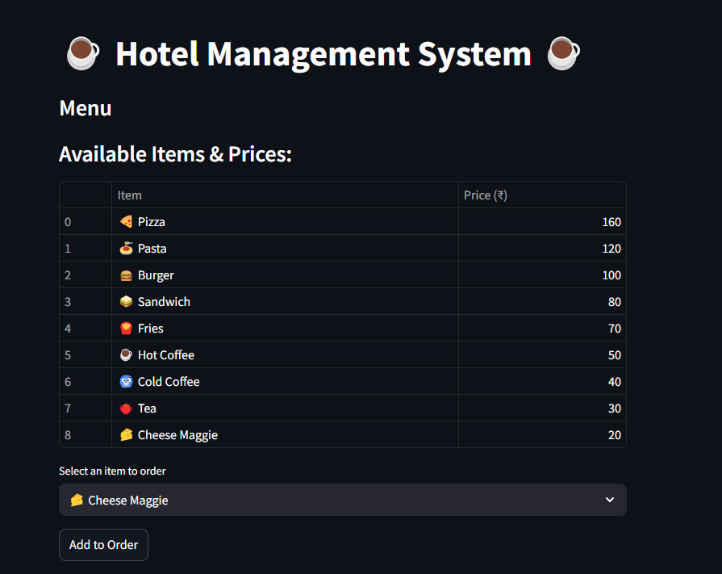
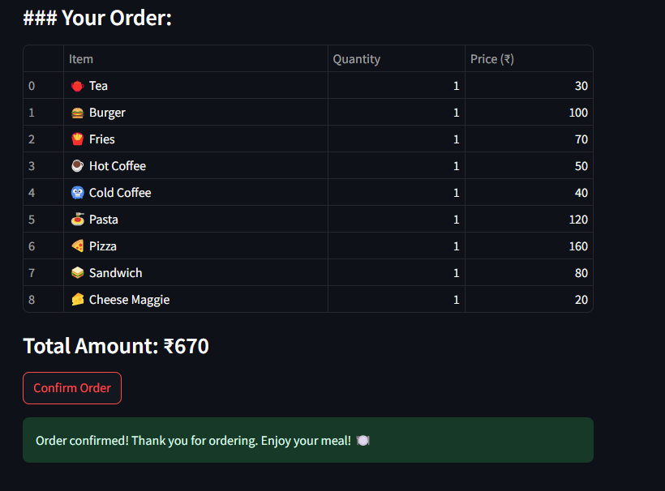

# 🏨 **Hotel Management System**

A **Python-based application** that allows hotels to efficiently manage customer orders, generate bills, and display the menu.  

---

## 📍 **Features**
✅ **Menu Display:** View the list of available dishes with prices.  
✅ **Order Confirmation:** Confirm selected orders and generate a bill.  
✅ **Bill Generation:** Automatically calculates and displays the total bill.  
✅ **User-friendly Interface:** Simple and easy-to-use GUI design.  

---

## 💻 **Technologies Used**
- **Python**  

---

## 🛠️ **Output Screenshots**

### 🍽️ Menu Display  
  

### 🧾 Confirm Order and Bill  
  

---

## 👩‍💻 **Created By**
👤 **Ayesha Siddiqa JH**  
📧 [Email](mailto:ayeshasiddiqajh422@gmail.com) | 🔗 [LinkedIn](https://www.linkedin.com/in/ayesha-siddiqa-j-h-1866ab334/) | 🖥️ [GitHub](https://github.com/Ayesha-Siddiqa-JH)  
